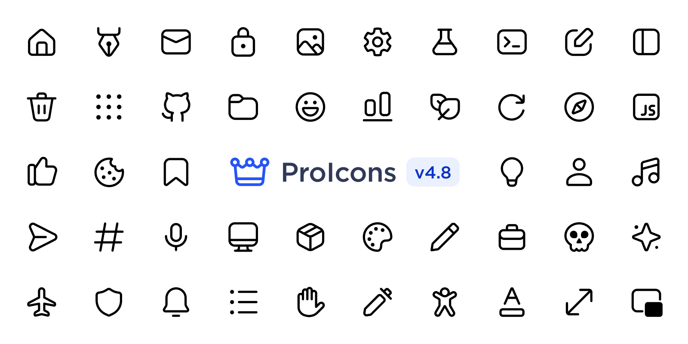

# ProIcons

  

<b>A collection of 400+ modern and open-source icons</b>

## Credits
- Icon design and guidelines inspired by Microsoft's [Fluent System Icons](https://github.com/microsoft/fluentui-system-icons)
- Alpha bleeding script from https://github.com/Corecii/Transparent-Pixel-Fix

